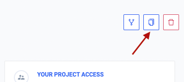
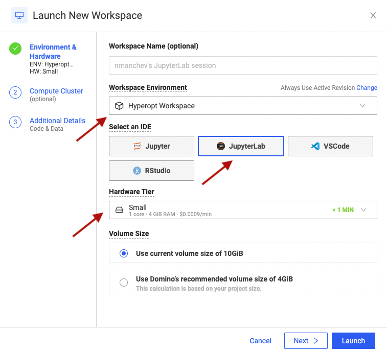
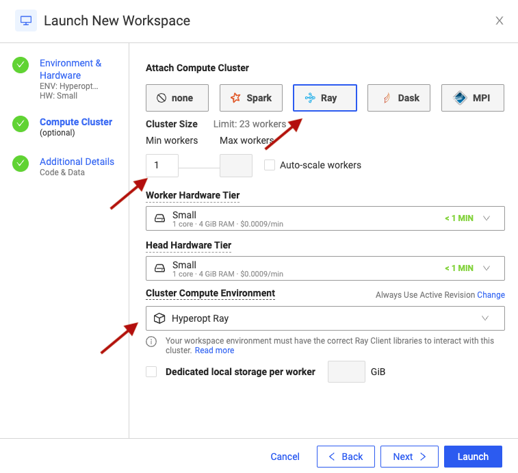

Welcome to the Getting started with Hyperparameter Optimisation project.

__Please start by creating a copy of this project in your personal projects space.__
To avoid accidentaly modifying the master project, please create a copy in your personal projects space. You can do this by clicking the Copy button in the top-right corner of the screen. 

This will open a Copy dialog, promting you to enter a new project name. You can leave this field blank and keep the project's original name. Since the copy will reside in your personal namespace, its name will not clash with the original project. 
Now click the __Copy__ button. Domino creates a personal copy of this project and automatically switches you to this new copy.

### Project description

This project contains all the hands-on work for the Getting started with Hyperparameter Optimisation workshop. All the assets are available in the [Files](browse) section section of the project. The two key directories to be aware of are 

* `hands-on` - contains the hands-on labs
* `hands-on-sol` - contains the solutions to all labs. Our advice is to only look at the solution after you've completed the relevant lab.

### Setting up your JupyterLab workspace

A Domino workspace is an interactive session where you can conduct research, analyze data, train models, and more. Use workspaces to work in the development environment of your choice, like [Jupyter](https://jupyter.org/) notebooks, [RStudio](https://rstudio.com/), [VS Code](https://code.visualstudio.com/), and many other customizable environments.

When creating a new Workspace for this workshop, please keep the following in mind:

* Make sure you select JupyterLab as your IDE
* Make sure the select compute environment is left to the default value (Hyperopt Workspace)
* Make sure your hardware tier is set to "Small".

To create a new Workspace for your project, go to Workspaces -> Create New Workspace, or simply press the button below:

### Setting up your Ray workspace

We'll use a distributed Ray cluster for the second part of this workshop. You could attach a cluster to your existing workspace or simply create a second one for your project. Whichever way you decide to go, the settings in the Environment & Hardware section should be identical to what we used initially. 
The only change you need to make is in the Compute Cluster section, which should look like this:

* Make sure that "Attach Compute Cluster" is set to Ray
* Make sure that "Min workers" is set to 1
* Make sure that "Cluster Compute Environment" is set to "Ray Cluster Environment 1.12"

